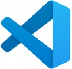

# AI-900 Labs
## Using Visual Studio Code

1.  Start Visual Studio Code. When it opens, you should see the MSLEARN-AI900 project on the left-hand panel.
2.  We will pull the latest version of the project. In the open terminal type +++getfiles.cmd+++ and press **enter**. This command pulls the latest version of the project to your folder. 
3.  Once the command runs, you can close the terminal panel. Now you can begin the lab. 